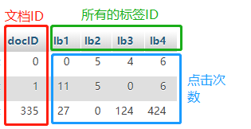
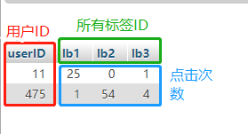
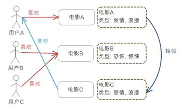
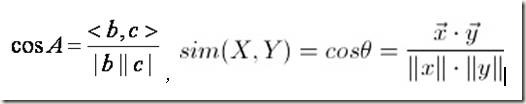
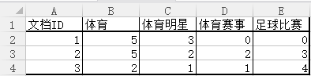
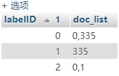

# 基于内容的文档推荐

* ## 数据准备  
1. 保存每个文档在每个标签下的点击次数

2. 保存每个用户点击每个标签的次数

* ## 数据库准备
1. 每个文档在每个标签下的点击次数的表,doc_label_freq 
 

2. 每个用户点击每个标签的次数的表,user_label_freq. 
 

3. 保存文档离线推荐结果的表,doc_recommend_offline.以及相似的用户离线推荐结果的表user_recommend_offline 
 

4. 标签-文档的倒排索引表postinglist,记录某个标签下包含那些文档 
 

* ## 基本算法介绍
> 因为可以利用的信息比较少,所以采用*基于内容的推荐算法*;如果未来可以收集更多的用户信息,如关系网,位置,基本信息等或者文档信息,如该文档被那些用户点击了等信息可以采用更加全面的推荐算法,如协同过滤算法.文末会贴出这些算法的介绍.

* 基于内容的推荐算法介绍

基于内容的推荐是在推荐引擎出现之初应用最为广泛的推荐机制，它的核心思想是根据推荐物品或内容的元数据，发现物品或者内容的相关性，然后基于用户以往的喜好记录，推荐给用户相似的物品。下图给出了基于内容推荐的基本原理。 
 
上图给出了基于内容推荐的一个典型的例子，电影推荐系统，首先我们需要对电影的元数据有一个建模，这里只简单的描述了一下电影的类型；然后通过电影的元数据发现电影间的相似度，因为类型都是“爱情，浪漫”电影 A 和 C 被认为是相似的电影（当然，只根据类型是不够的，要得到更好的推荐，我们还可以考虑电影的导演，演员等等）；最后实现推荐，对于用户 A，他喜欢看电影 A，那么系统就可以给他推荐类似的电影 C。

因为需要基于用户以往的喜好历史做出推荐，所以对于新用户有“*冷启动*”的问题。

* 算法的应用过程

在文档推荐过程,我们保存了文档在每个标签下被点击的次数,将这个数据作为元数据标记一个文档.用一个一维数组表示一个文档,所有的文档的集则构成一个二维数组.例如文档i的元数据数组为(0,0,55,33,22),表示系统共有5个标签,标签ID分别为0,1,2,3,4;其中i通过标签0被点击的次数为0次,通过标签2被点击的次数为55次,以此类推.

文档有了特定的元数据即代表由元数据组成的模型(向量)就可以代表该文档,接下来我们就需要通过元数据计算两个文档的相似度.我们将文档转换为向量,即将文档相似问题转为向量距离问题.计算向量距离的公式有很多,这里采用的是Cosine距离,即 
 
也就是文档X,Y的相似度等于X,Y元数据组成的向量的cosine距离.

由此我们可以计算出文档i和文档集中其他文档的相似度,然后排序即可得到推荐结果.如果每一个用户点击同一篇文章得到的都是相同的结果,并且这种结果不会有太大的改变的话,显然推荐效果并不好,所以我们需要在此基础上,增加基于用户的文档推荐.原理其实很简单,和基于文档的推荐的过程是一致的.用户点击各个标签的次数组成用户的元数据向量,计算用户向量和文档集中所有文档向量的距离,,然后排序即可得到推荐结果,即通过用户的喜好计算出用户可能会喜欢的文档推荐.

但是,基于内容的推荐算法有"冷启动"问题,所以需要将基于文档的推荐结果和基于用户的推荐结果进行整合,但是当新用户(没有点击过任何文档)点击一个新文档(没有被任何用户点击)的时候,这样的冷启动现象基于上面两种计算都不会有推荐结果,我们将如何解决呢?在解决这个问题之前,我们先对上面的步骤进行一些改进.

* ## 算法改进
> Q : 直接利用文档在某个标签下被点击次数作为文档的元数据是否合理?

假设有一组标签为"体育","体育明星","体育赛事","足球比赛",有一组文档集在该组标签下的元数据为1(5,3,0,0);2(5,2,2,3);3(2,1,1,4),如图 
 
我们从直观上来看,三篇文档都关于体育方面的文档,但是文档1应该是侧重讲体育明星的,和体育赛事甚至足球都没有太大关系,但是文档2,3则更可能是关于足球赛事和足球明星的文档,当我们为文档2推荐时,文档1的相似度为0.9764,而文档3的相似度仅有0.85.这明显和我们的预期不太一样.

主要原因在于我们没有提取出"*关键标签*".在上面这个例子中,所有文档都包含了"体育"标签,当某两个文档在"体育"上的点击量都较大时(如文档1,2),计算的相似度就会比较大,但是往往在相似度中比较重要的是两个均有出现的不常见标签(如标签"足球赛事").

我们需要一个重要性调整系数，衡量一个词是不是常见词。如果某个词比较少见，但是它在这篇文章中多次出现，那么它很可能就反映了这篇文章的特性，正是我们所需要的关键词。用统计学语言表达，就是在词频的基础上，要对每个词分配一个"重要性"权重。最常见的词（"的"、"是"、"在"）给予最小的权重，较常见的词（"中国"）给予较小的权重，较少见的词（"蜜蜂"、"养殖"）给予较大的权重。这里权重就是在文档搜索时常用的一个概念--"*逆文档频率*"（Inverse Document Frequency，缩写为IDF）.
IDF的大小与一个词的常见程度成反比.知道了"词频"（TF）和"逆文档频率"（IDF）以后，将这两个值相乘，就得到了一个词的TF-IDF值。某个词对文章的重要性越高，它的TF-IDF值就越大。

回归文档推荐问题中,我们将文档在某标签下被点击的次数作为TF值,单单用TF来表示一个文档是不够全面的,我们还需要统计每个标签出现在多少篇文档中,然后将TF值修正为TF-IDF值． 
步骤:
1. 从数据库中获取TF值,保存在二维数组Doc[][]中;
2. 遍历二维数组,得到每个标签在多少文档中出现过,计算IDF值 
 
3. 修改Doc[][]的值为TF-IDF值 
 

> Q : 如果每篇文档的推荐结果都和所有的文件进行计算排列,计算量会不会太大?

基于内容的推荐算法不能够避免计算,但是我们可以减少需要计算的集合.我们可以发现,如果两篇文档不存在相同的标签,那么相似度必然是0,所以实际上和计算相似度文档包含一个或多个相同的标签的文档才应该被列入计算范围.
这里我们将采用布尔检索中常用的数据结构--倒排索引表(posting list)来实现缩小范围 
 
存储结构如上图所示,假设我们需要计算文档335的相似文档,文档335包含有标签0,1.我们只需在数据库中获取标签ID=0or1的doc_list并做一个并集处理,我们会得到集合{0,335},除去自身335,实际只需要计算文档0,为不需要计算文档1.当数据量增大,标签逐渐分化后,这样的好处会大大凸显.

> Q : 新用户点击新文档的冷启动问题,怎么解决?

新用户和新文档的元数据向量都等于或接近于{0,0,...,0},这样基于文档和用户两种策略得到的结果都将很少.所以我们将采用基于倒排索引表的布尔检索进行推荐.我们得到点击文档的标签(前提条件是,新文档必然有标签),获取postinglist中这些标签的doc_list.首先对doc_list做一个交集,这显然是最好的结果,但是这往往可能达不到推荐数量的要求,所以需要再做一个并集的操作,防止数量的缺失.